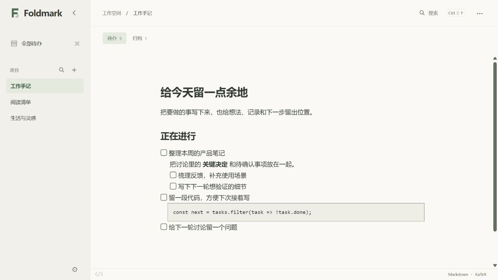

<p align="center">
  
</p>

<h1 align="center">Foldmark</h1>

<p align="center">把待办和笔记，写在同一份 Markdown 里。</p>
<p align="center">Windows x64 · 本地文件 · MIT</p>

<p align="center">
  <a href="https://github.com/Mowonhua/foldmark/releases">下载预发布版</a> ·
  <a href="./docs/使用.md">使用指南</a> ·
  <a href="./docs/主题.md">自制主题</a> ·
  <a href="https://github.com/Mowonhua/foldmark/issues">反馈问题</a>
</p>

Foldmark 是面向 Windows 的多项目 Markdown 待办编辑器。在任务下面接着写正文、代码和公式，折叠暂时不需要的细节，再回到手头的一件事。

<p align="center">
  
</p>

## 一份文件，一个项目

关联已有 `.md` 文件，就能开始编辑。正文保留在原来的位置，其他编辑器也能继续打开；移除项目只移除关联。

- **任务和上下文放在一起**：支持嵌套任务、代码高亮、KaTeX 公式和图片，拖动列表标记调整同级顺序。
- **完成后归档，随时恢复**：任务及其完整子树移到同一文件末尾的 `# 归档` 区域；恢复后回到待办区域末尾。
- **从多个项目找到下一步**：在“全部待办”中浏览项目任务，跨项目搜索后直接定位到原文。
- **阅读方式由你选择**：预览与分区源码视图可以切换；内置纸面、双色和新拟物主题，支持浅色、深色及自制主题。

输入后自动保存。遇到外部修改、文件冲突或保存失败时，应用保留待处理内容并提供恢复入口。[查看保存与恢复规则 →](./docs/使用.md#保存外部编辑与恢复)

<details>
<summary>任务文件仍然是普通 Markdown</summary>

````markdown
# 工作手记

- [ ] 整理产品笔记

  把 **关键决定** 和待确认事项放在一起。

  - [ ] 梳理反馈
  - [ ] 写下下一步

# 归档

- [x] 建立项目清单
````

</details>

## 开始使用

1. 从 [GitHub Releases](https://github.com/Mowonhua/foldmark/releases) 下载 Windows x64 的 `-setup.exe` 安装包。
2. 打开 Foldmark，点击“新增项目”，关联已有 Markdown 或新建一份清单。
3. 输入 `- [ ]` 写下任务；`Enter` 继续下一项，空任务上再按一次 `Enter` 退出列表。

当前发布处于 **alpha 预发布阶段**。桌面运行需要 WebView2；缺少运行时的设备会在首次安装时联网下载。

“更多操作 → 检查更新”提供更新入口，默认启动检查并自动下载。点击“安装并重启”后，全部文档和配置保存成功才会安装。[自动更新与发布流程 →](./docs/发布.md)

## 本地开发

项目使用 **Tauri 2 · Svelte 5 · TypeScript · CodeMirror 6**。Windows 开发需要 Node.js、npm、Rust 和 MSVC C++ 构建工具。

```powershell
npm ci
npm run tauri -- dev
```

只预览前端可运行 `npm run dev`。浏览器预览导入文件副本；直接关联原文件和系统文件监听需要桌面版。

<p>
  <a href="https://github.com/Mowonhua/foldmark/actions/workflows/ci.yml"></a>
</p>

[构建、测试与性能采样](./docs/开发.md) · [产品与技术方案](./docs/方案.md) · [首版验收记录](./docs/验收检查.md)

## 许可证

[MIT License](./LICENSE) · Copyright © 2026 Mowonhua
